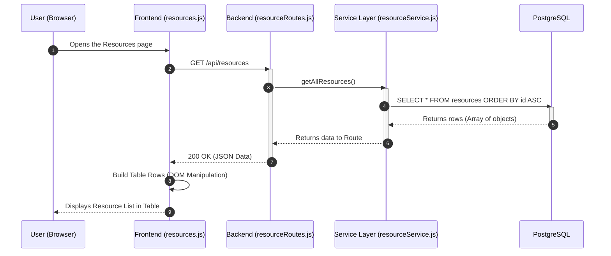

# 📘 Booking System CRUD Data Flow (Phase 6)

This document models the data flow for the Booking System, verified using Browser Developer Tools.

---

## 1. CREATE (C) - Adding a Resource
**Endpoint:** `POST /api/resources`

```mermaid
sequenceDiagram
    autonumber
    participant U as User (Browser)
    participant F as Frontend (form.js)
    participant B as Backend (resourceRoutes.js)
    participant DB as PostgreSQL

    U->>F: Enters Name & Type, clicks "Submit"
    F->>B: POST /api/resources (JSON Body)
    activate B
    
    alt Success Case (201 Created)
        B->>DB: INSERT INTO resources (name, type) VALUES ($1, $2)
        activate DB
        DB-->>B: Row Inserted Successfully
        deactivate DB
        B-->>F: 201 Created (New Resource Object)
        deactivate B
        F-->>U: Success Toast & UI Update
    else Validation Failed (400 Bad Request)
        B-->>F: 400 Bad Request (Missing fields)
        deactivate B
        F-->>U: Display validation error message
    end
```

## 2. READ (R) - Fetching the List
**Endpoint:** `GET /api/resources`



## 3. UPDATE (U) - Modifying a Resource
**Endpoint:** `PUT /api/resources/:id`

```mermaid
sequenceDiagram
    autonumber
    participant U as User (Browser)
    participant F as Frontend (form.js)
    participant B as Backend (resourceRoutes.js)
    participant DB as PostgreSQL

    U->>F: Changes Name/Type & clicks "Save"
    F->>B: PUT /api/resources/:id (JSON Body)
    activate B
    
    B->>DB: UPDATE resources SET name=$1, type=$2 WHERE id=$3
    activate DB
    
    alt Resource Found & Valid
        DB-->>B: Row updated successfully
        deactivate DB
        B-->>F: 200 OK (Updated Data)
        deactivate B
        F-->>U: UI updates row & shows success message
    else Resource Not Found (e.g. ID 999)
        B-->>F: 404 Not Found
        deactivate B
        F-->>U: Error Alert: "Resource not found"
    end
```

## 4. DELETE (D) - Removing a Resource
**Endpoint:** `DELETE /api/resources/:id`

```mermaid
sequenceDiagram
    autonumber
    participant U as User (Browser)
    participant F as Frontend (resources.js)
    participant B as Backend (resourceRoutes.js)
    participant DB as PostgreSQL

    U->>F: Clicks "Delete" button
    F->>B: DELETE /api/resources/:id
    activate B
    
    B->>DB: DELETE FROM resources WHERE id = $1;
    activate DB
    
    alt Resource Exists
        DB-->>B: Row deleted (Success)
        deactivate DB
        B-->>F: 204 No Content
        deactivate B
        F->>F: Remove row from DOM
        F-->>U: Resource disappears from list
    else Resource Not Found (404)
        B-->>F: 404 Not Found
        deactivate B
        F-->>U: Error Alert: "Could not find resource to delete"
    end
```